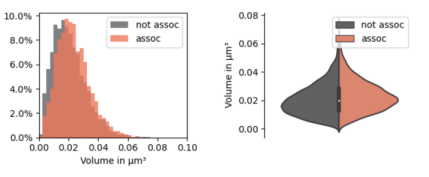
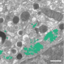
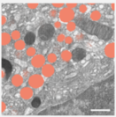

# Protocol Notebooks 

This repository contains the code that accompanies the protocol paper

*Müller, Andreas, et al. *
*Organelle-specific segmentation, spatial analysis and visualization of volume electron microscopy datasets* 

The following subfolders contain code that augment described protocol steps: 

1. [Organelle Interaction Plots](./plots)
    
    

    Notebooks relating to the generation of organelle interaction plots

2. [3D segmentation of golgi apparatus with U-Net](./unet)
   
    

    Training and prediction notebooks for a 3D U-Net model for segmentation of golgi aparatus from FIB-SEM volumes

3. [3D segmentation of secretory granules with `stardist`](./stardist/)

    

    Training and prediction notebooks for a 3D U-Net stardist model for segmentation of secretory granules from FIB-SEM volumes
