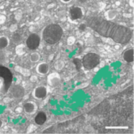

# 3D segmentation of golgi aparatus with a 3D U-Net




The code in this folder demonstrates how to train a 3D U-Net model to perform semantic segmentation of the golgi aparatus from 3D FIB-SEM data as described in the paper:

*Müller, Andreas, et al. "3D FIB-SEM reconstruction of microtubule–organelle interaction in whole primary mouse β cells." Journal of Cell Biology 220.2 (2021).*


## Installation/Preparation  

1. Install tensorflow with gpu support 

2. Install csbdeep and dependencies:

    - `pip install csbdeep gputools tqdm`
    - `pip install git+https://github.com/stardist/augmend.git`
    
    
3. Download the example data (or adapt your own data into the same format)

    - `wget https://syncandshare.desy.de/index.php/s/FikPy4k2FHS5L4F/download/data_golgi.zip`
    - `unzip data_golgi.zip`

   which should result in the following folder structure:
    ```
    data_golgi
    ├── train
    │   ├── images
    │   └── masks
    └── val
        ├── images
        └── masks
    ```

## Usage

Simply run the [notebook](unet.ipynb) for training a U-Net model and subsequent prediction on new stacks. 